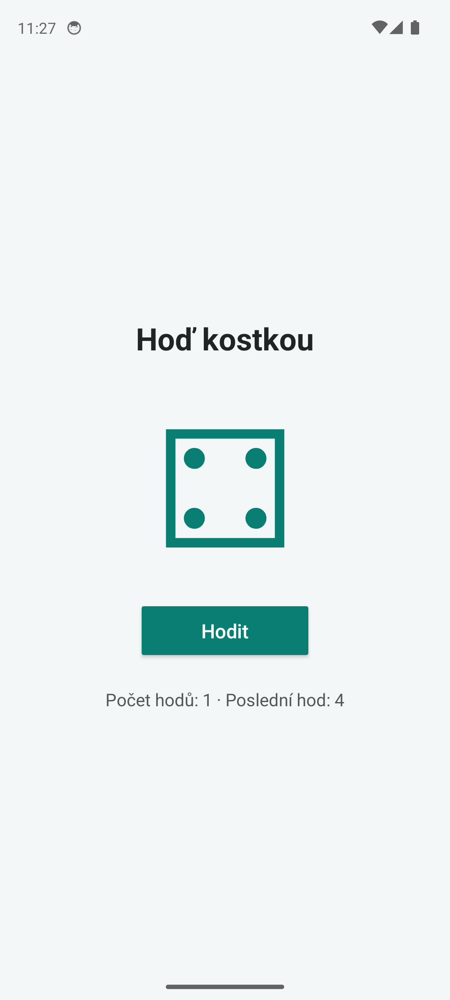
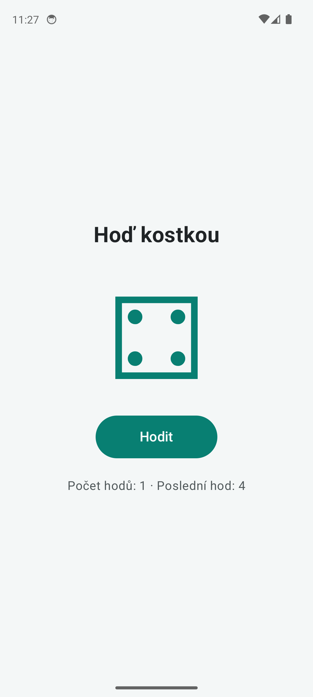

# PMA 2026

## Projekty

- `task-002-guess-number`: Uhodni cislo, XML a Kotlin (ukol 002).
- `task-003-dice-xml`: Hod kostkou, Empty Views Activity s `findViewById`.
- `task-003-dice-compose`: Hod kostkou, Empty Activity s Jetpack Compose.

Kazdou slozku otevri v Android Studiu jako samostatny projekt a spust na
emulatoru nebo telefonu s Androidem 7.0 (API 24) nebo vyssim. Projekty pouzivaji
SDK 37 a Gradle Wrapper. Lokalni cestu k SDK nastavi Android Studio pri otevreni.

## Ukol 003: Hod kostkou

Obe aplikace zobrazuji nadpis "Hoď kostkou", symbol kostky a tlacitko "Hodit".
Po stisku probehne deset nahodnych zmen symbolu s prodlevou 250 ms. Po 2,5 s
se vylosuje konecny vysledek. Tlacitko je po celou animaci zakazane.
Obsah je vystredeny a respektuje systemove listy.

### XML vs. Compose

| XML + Kotlin | Jetpack Compose |
| --- | --- |
| Rozlozeni je v `activity_main.xml`. | Rozlozeni sestavuje funkce `DiceScreen` v Kotlinu. |
| `findViewById` ziska reference na TextView a Button. | Composable funkce vytvareji prvky primo, bez XML ID. |
| Kazdy mezihod explicitne priradi symbol do `diceText.text`. | Zmena `diceValue` ve sledovanem stavu automaticky vyvola rekompozici a aktualizuje `Text`. |
| `isEnabled` primo zapina a vypina tlacitko. | `enabled = !isRolling` odvozuje stav tlacitka ze stavu obrazovky. |
| `lifecycleScope` zrusi animaci pri zniceni Activity. | `rememberCoroutineScope` zrusi animaci pri opusteni kompozice. |

### Vylepseni

Pocitadlo dokoncenych hodu a posledni vysledek. Tyto hodnoty i symbol kostky
preziji otoceni zarizeni: XML pouziva `onSaveInstanceState`, Compose
`rememberSaveable`. Probihajici animace se pri otoceni zrusi; tlacitko je
na nove obrazovce opet dostupne. Symbol ma take textovy popis pro pristupnost.

### Screenshoty

Zadani: https://github.com/zizanek/github-tz-pma-2026/issues/3
